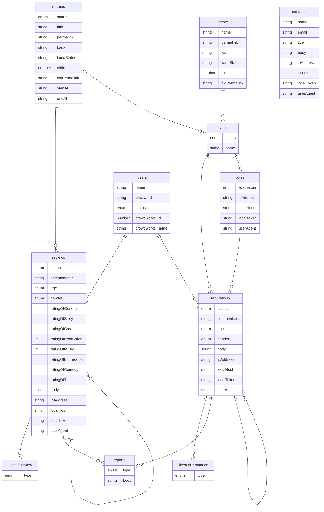

```mermaid
erDiagram

dramas ||--o{ reviews: ""
dramas ||--o{ casts: ""
actors ||--o{ casts: ""
casts ||--o{ reputations: ""
votes ||--o{ reputations: ""
casts ||--o{ votes: ""
reputations ||--o{ likesOfReputation: ""
reviews ||--o{ likesOfReview: ""
users ||--o{ reviews: ""
users ||--o{ reputations: ""
reputations ||--o{ reports: ""
reviews ||--o{ reports: ""
reputations ||--o{ reputations: ""
reviews ||--o{ reviews: ""

users {
    string name
    string password
    enum status
    number crowdworks_id
    string crowdworks_name
}

dramas {
    enum status
    string title
    string permalink
    string kana
    string kanaStatus
    number oldId
    string oldPermalink
    string startAt
    string endAt
}

casts {
    enum status
    string name
}

actors {
    string name
    string permalink
    string kana
    string kanaStatus
    number oldId
    string oldPermalink
}

votes {
    enum evaluatoin
    string ipAddress
    strin localHost
    string localToken
    string userAgent
}

reputations {
    enum status
    string commentator
    enum age
    enum gender
    stiring body
    string ipAddress
    strin localHost
    string localToken
    string userAgent
}

likesOfReputation {
    enum type 
}

likesOfReview {
    enum type
}

reviews {
    enum status
    string commentator
    enum age
    enum gender
    int ratingOfGeneral
    int ratingOfStory
    int ratingOfCast
    int ratingOfProduction
    int ratingOfMusic
    int ratingOfImpression
    int ratingOfComedy
    int ratingOfThrill
    stiring body
    string ipAddress
    strin localHost
    string localToken
    string userAgent
}

reports {
    enum type
    string body
}

contacts {
    string name
    string email
    string title
    string body
    string ipAddress
    strin localHost
    string localToken
    string userAgent
}
```