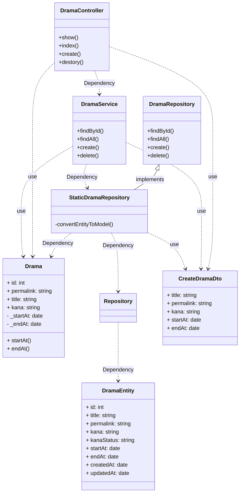

```mermaid
classDiagram
    DramaRepository <|-- StaticDramaRepository: implements
    DramaService ..> StaticDramaRepository: Dependency
    DramaController ..> DramaService: Dependency
    StaticDramaRepository ..> Drama: Dependency
    StaticDramaRepository ..> Repository: Dependency
    Repository ..> DramaEntity: Dependency
    DramaController ..> CreateDramaDto: use
    DramaService ..> CreateDramaDto: use
    StaticDramaRepository ..> CreateDramaDto: use
    DramaController ..> Drama: use
    DramaService ..> Drama: use
    class DramaRepository {
        +findById()
        +findAll()
        +create()
        +delete()
    }
    class StaticDramaRepository {
        -convertEntityToModel()
    }
    class DramaService {
        +findById()
        +findAll()
        +create()
        +delete()
    }
    class DramaController {
        +show()
        +index()
        +create()
        +destory()
    }
    class Drama {
        + id: int
        + permalink: string
        + title: string
        + kana: string
        - _startAt: date
        - _endAt: date
        + startAt()
        + endAt()
    }
    class CreateDramaDto {
        + title: string
        + permalink: string
        + kana: string
        + startAt: date
        + endAt: date
    }
    class DramaEntity {
        + id: int
        + title: string
        + permalink: string
        + kana: string
        + kanaStatus: string
        + startAt: date
        + endAt: date
        + createdAt: date
        + updatedAt: date
    }
```