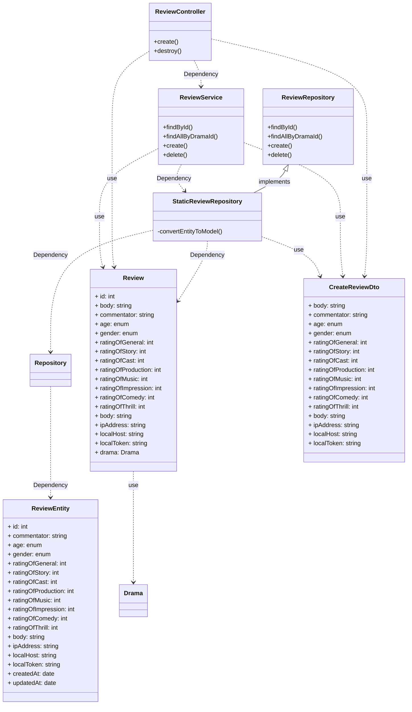

```mermaid
classDiagram
    ReviewRepository <|-- StaticReviewRepository: implements
    ReviewService ..> StaticReviewRepository: Dependency
    ReviewController ..> ReviewService: Dependency
    StaticReviewRepository ..> Review: Dependency
    StaticReviewRepository ..> Repository: Dependency
    Repository ..> ReviewEntity: Dependency
    ReviewController ..> CreateReviewDto: use
    ReviewService ..> CreateReviewDto: use
    StaticReviewRepository ..> CreateReviewDto: use
    ReviewController ..> Review: use
    ReviewService ..> Review: use
    Review ..> Drama: use
    class ReviewRepository {
        +findById()
        +findAllByDramaId()
        +create()
        +delete()
    }
    class StaticReviewRepository {
        -convertEntityToModel()
    }
    class ReviewService {
        +findById()
        +findAllByDramaId()
        +create()
        +delete()
    }
    class ReviewController {
        +create()
        +destroy()
    }
    class Review {
        + id: int
        + body: string
        + commentator: string
        + age: enum
        + gender: enum
        + ratingOfGeneral: int
        + ratingOfStory: int
        + ratingOfCast: int
        + ratingOfProduction: int
        + ratingOfMusic: int
        + ratingOfImpression: int
        + ratingOfComedy: int
        + ratingOfThrill: int
        + body: string
        + ipAddress: string
        + localHost: string
        + localToken: string
        + drama: Drama
    }
    class CreateReviewDto {
        + body: string
        + commentator: string
        + age: enum
        + gender: enum
        + ratingOfGeneral: int
        + ratingOfStory: int
        + ratingOfCast: int
        + ratingOfProduction: int
        + ratingOfMusic: int
        + ratingOfImpression: int
        + ratingOfComedy: int
        + ratingOfThrill: int
        + body: string
        + ipAddress: string
        + localHost: string
        + localToken: string
    }
    class ReviewEntity {
        + id: int
        + commentator: string
        + age: enum
        + gender: enum
        + ratingOfGeneral: int
        + ratingOfStory: int
        + ratingOfCast: int
        + ratingOfProduction: int
        + ratingOfMusic: int
        + ratingOfImpression: int
        + ratingOfComedy: int
        + ratingOfThrill: int
        + body: string
        + ipAddress: string
        + localHost: string
        + localToken: string
        + createdAt: date
        + updatedAt: date
    }
```