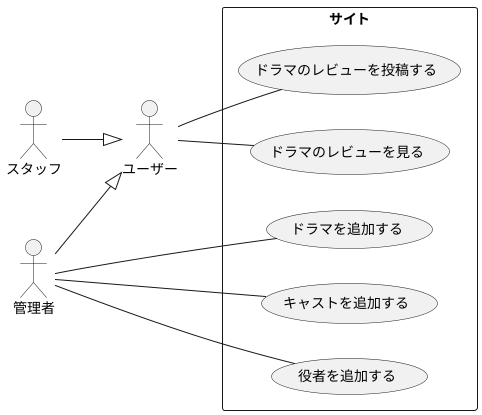

```plantuml
@startuml
left to right direction
actor "ユーザー" as user
actor "管理者" as admin
actor "スタッフ" as staff
rectangle サイト {
    usecase (ドラマを追加する) as addDrama
    usecase (キャストを追加する) as addCast
    usecase (役者を追加する) as addActor
    usecase (ドラマのレビューを見る) as showDramaReview
    usecase (ドラマのレビューを投稿する) as postDramaReview
}
user -- showDramaReview
user -- postDramaReview
admin -- addDrama
admin -- addCast
admin -- addActor
admin --|> user
staff --|> user
```