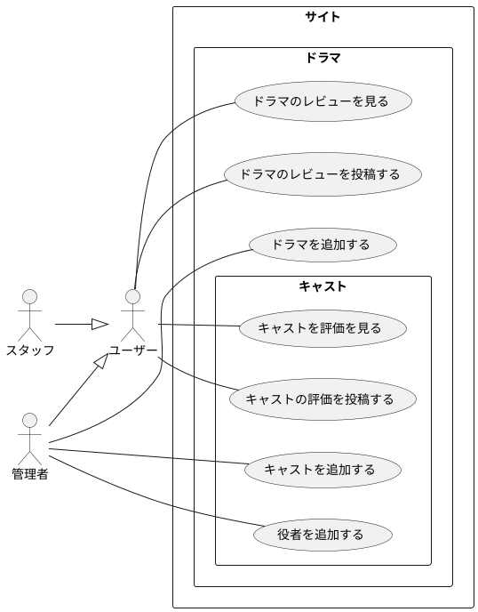

```plantuml
@startuml
left to right direction
actor "ユーザー" as user
actor "管理者" as admin
actor "スタッフ" as staff
rectangle サイト {
    rectangle ドラマ {
        usecase (ドラマを追加する) as addDrama
        usecase (ドラマのレビューを見る) as showDramaReview
        usecase (ドラマのレビューを投稿する) as postDramaReview
        rectangle キャスト {
            usecase (キャストを評価を見る) as showCastReputation
            usecase (キャストを追加する) as addCast
            usecase (キャストの評価を投稿する) as addCastReputation
            usecase (役者を追加する) as addActor
        }
    }
}
user -- showDramaReview
user -- postDramaReview
user -- showCastReputation
user -- addCastReputation
admin -- addDrama
admin -- addCast
admin -- addActor
admin --|> user
staff --|> user
```